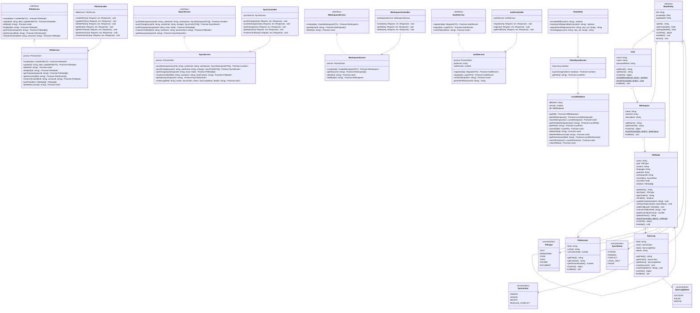

# Safar - Class Diagram

## Complete Class Diagram

```mermaid
classDiagram
    direction TB

    class FileType {
        <<enumeration>>
        TEXT
        MARKDOWN
        CODE
        TODO
        FOLDER
        DOCUMENT
    }

    class SyncStatus {
        <<enumeration>>
        SYNCED
        PENDING
        CONFLICT
        LOCAL_ONLY
        FAILED
    }

    class SyncAction {
        <<enumeration>>
        CREATE
        UPDATE
        DELETE
        RESOLVE_CONFLICT
    }

    class SyncLogStatus {
        <<enumeration>>
        SUCCESS
        FAILED
        PARTIAL
    }

    %% ===== INTERFACES =====
    class IFileService {
        <<interface>>
        +create(data: CreateFileDTO) Promise~FileNode~
        +update(id: string, data: UpdateFileDTO) Promise~FileNode~
        +delete(id: string) Promise~void~
        +findById(id: string) Promise~FileNode~
        +getTree(workspaceId: string) Promise~FileNode[]~
        +getVersions(fileId: string) Promise~FileVersion[]~
        +restoreVersion(fileId: string, versionId: string) Promise~FileNode~
    }

    class ISyncService {
        <<interface>>
        +pushWorkspaces(userId: string, userEmail: string, workspaces: SyncWorkspaceDTO[]) Promise~number~
        +pushChanges(userId: string, userEmail: string, changes: SyncPushDTO[]) Promise~SyncResult~
        +pullChanges(workspaceId: string, since: Date) Promise~FileNode[]~
        +resolveConflict(fileId: string, resolution: string, localContent: string) Promise~FileNode~
        +getStatus(workspaceId: string) Promise~SyncStatusInfo~
    }

    class IWorkspaceService {
        <<interface>>
        +create(data: CreateWorkspaceDTO) Promise~Workspace~
        +getAll(userId: string) Promise~Workspace[]~
        +delete(id: string) Promise~void~
    }

    class IAuthService {
        <<interface>>
        +register(data: RegisterDTO) Promise~AuthResult~
        +login(data: LoginDTO) Promise~AuthResult~
        +verifyToken(token: string) Promise~User~
    }

    %% ===== BASE CLASS =====
    class BaseEntity {
        <<abstract>>
        #id: string
        #createdAt: Date
        #updatedAt: Date
        +getId() string
        +getCreatedAt() Date
        +getUpdatedAt() Date
        +toJSON() object
        #validate() void*
        #touch() void
    }

    %% ===== MODEL CLASSES =====
    class User {
        -email: string
        -name: string
        -passwordHash: string
        +getEmail() string
        +getName() string
        +toJSON() object
        +isValidEmail(email: string)$ boolean
        +fromPrisma(data: object)$ User
        #validate() void
    }

    class Workspace {
        -name: string
        -ownerId: string
        -description: string
        +getName() string
        +getOwnerId() string
        +toJSON() object
        +fromPrisma(data: object)$ Workspace
        #validate() void
    }

    class FileNode {
        -name: string
        -type: FileType
        -content: string
        -language: string
        -parentId: string
        -workspaceId: string
        -syncStatus: SyncStatus
        -syncedAt: Date
        -children: FileNode[]
        +getName() string
        +getType() FileType
        +getContent() string
        +isFolder() boolean
        +updateContent(content: string) void
        +setSyncStatus(status: SyncStatus) void
        +addChild(node: FileNode) void
        +removeChild(childId: string) void
        +getDescendantCount() number
        +getExtension() string
        +fromPrisma(data: object)$ FileNode
        +toJSON() object
        #validate() void
    }

    class FileVersion {
        -fileId: string
        -content: string
        -versionNumber: number
        +getFileId() string
        +getContent() string
        +getVersionNumber() number
        +toJSON() object
        #validate() void
    }

    class SyncLog {
        -fileId: string
        -action: SyncAction
        -status: SyncLogStatus
        -details: string
        +getFileId() string
        +getAction() SyncAction
        +getStatus() SyncLogStatus
        +markSuccess() void
        +markFailed(error: string) void
        +toJSON() object
        #validate() void
    }

    %% ===== SERVICE CLASSES =====
    class FileService {
        -prisma: PrismaClient
        +create(data: CreateFileDTO) Promise~FileNode~
        +update(id: string, data: UpdateFileDTO) Promise~FileNode~
        +delete(id: string) Promise~void~
        +findById(id: string) Promise~FileNode~
        +getTree(workspaceId: string) Promise~FileNode[]~
        +getVersions(fileId: string) Promise~FileVersion[]~
        +restoreVersion(fileId: string, versionId: string) Promise~FileNode~
        -buildTree(files: FileNode[]) FileNode[]
        -deleteRecursive(id: string) Promise~void~
    }

    class SyncService {
        -prisma: PrismaClient
        +pushWorkspaces(userId: string, userEmail: string, workspaces: SyncWorkspaceDTO[]) Promise~number~
        +pushChanges(userId: string, userEmail: string, changes: SyncPushDTO[]) Promise~SyncResult~
        +pullChanges(workspaceId: string, since: Date) Promise~FileNode[]~
        +resolveConflict(fileId: string, resolution: string, localContent: string) Promise~FileNode~
        +getStatus(workspaceId: string) Promise~SyncStatusInfo~
        -createLog(fileId: string, action: SyncAction, status: SyncLogStatus, details: string) Promise~void~
    }

    class WorkspaceService {
        -prisma: PrismaClient
        +create(data: CreateWorkspaceDTO) Promise~Workspace~
        +getAll(userId: string) Promise~Workspace[]~
        +delete(id: string) Promise~void~
        +findById(id: string) Promise~Workspace~
    }

    class AuthService {
        -prisma: PrismaClient
        -jwtSecret: string
        -saltRounds: number
        +register(data: RegisterDTO) Promise~AuthResult~
        +login(data: LoginDTO) Promise~AuthResult~
        +verifyToken(token: string) Promise~User~
        -generateToken(userId: string) string
    }

    %% ===== CONTROLLER CLASSES =====
    class FileController {
        -fileService: FileService
        +createFile(req: Request, res: Response) void
        +updateFile(req: Request, res: Response) void
        +deleteFile(req: Request, res: Response) void
        +getFile(req: Request, res: Response) void
        +getFileTree(req: Request, res: Response) void
        +getVersions(req: Request, res: Response) void
        +restoreVersion(req: Request, res: Response) void
    }

    class SyncController {
        -syncService: SyncService
        +pushChanges(req: Request, res: Response) void
        +pushWorkspaces(req: Request, res: Response) void
        +pullChanges(req: Request, res: Response) void
        +getStatus(req: Request, res: Response) void
        +resolveConflict(req: Request, res: Response) void
    }

    class WorkspaceController {
        -workspaceService: WorkspaceService
        +create(req: Request, res: Response) void
        +getAll(req: Request, res: Response) void
        +delete(req: Request, res: Response) void
    }

    class AuthController {
        -authService: AuthService
        +register(req: Request, res: Response) void
        +login(req: Request, res: Response) void
        +getProfile(req: Request, res: Response) void
    }

    %% ===== FRONTEND CLASSES =====
    class LocalDatabase {
        -dbName: string
        -version: number
        -db: IDBDatabase
        +getDB() Promise~IDBDatabase~
        +getAllWorkspaces() Promise~LocalWorkspace[]~
        +saveWorkspace(ws: LocalWorkspace) Promise~void~
        +getFilesByWorkspace(wsId: string) Promise~LocalFile[]~
        +getFile(id: string) Promise~LocalFile~
        +saveFile(file: LocalFile) Promise~void~
        +deleteFile(id: string) Promise~void~
        +deleteFileRecursive(id: string) Promise~void~
        +getFileVersions(fileId: string) Promise~LocalFileVersion[]~
        +saveFileVersion(v: LocalFileVersion) Promise~void~
        +clearAllData() Promise~void~
    }

    class ClientSyncService {
        -isSyncing: boolean
        +pushChanges(force: boolean) Promise~number~
        -getFile(id: string) Promise~LocalFile~
    }

    class PatchUtils {
        +isUnifiedDiff(content: string) boolean
        +hasSearchReplaceBlocks(content: string) boolean
        +applySearchReplace(current: string, new_val: string) string
        +smartApply(current: string, new_val: string) string
    }

    %% ===== INHERITANCE =====
    BaseEntity <|-- User
    BaseEntity <|-- Workspace
    BaseEntity <|-- FileNode
    BaseEntity <|-- FileVersion
    BaseEntity <|-- SyncLog

    %% ===== INTERFACE IMPLEMENTATIONS =====
    IFileService <|.. FileService
    ISyncService <|.. SyncService
    IWorkspaceService <|.. WorkspaceService
    IAuthService <|.. AuthService

    %% ===== RELATIONSHIPS =====
    User "1" --> "*" Workspace 
    Workspace "1" --> "*" FileNode 
    FileNode "1" --> "*" FileVersion 
    FileNode "1" --> "*" SyncLog 
    FileNode "1" --> "*" FileNode 
    FileNode --> FileType 
    FileNode --> SyncStatus 
    SyncLog --> SyncAction 
    SyncLog --> SyncLogStatus

    %% ===== DEPENDENCIES =====
    FileController --> FileService
    SyncController --> SyncService 
    WorkspaceController --> WorkspaceService 
    AuthController --> AuthService 
    ClientSyncService --> LocalDatabase 
    PatchUtils --> ClientSyncService
```