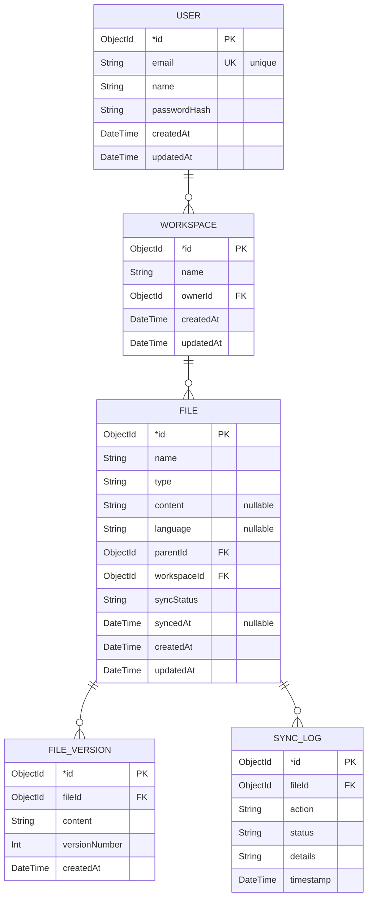

# Safar - ER Diagram 

## Entity Relationship Diagram

```mermaid
erDiagram
    USER {
        ObjectId *id PK
        String email UK "unique"
        String name
        String passwordHash
        DateTime createdAt
        DateTime updatedAt
    }

    WORKSPACE {
        ObjectId *id PK
        String name
        ObjectId ownerId FK
        DateTime createdAt
        DateTime updatedAt
    }

    FILE {
        ObjectId *id PK
        String name
        String type
        String content "nullable"
        String language "nullable"
        ObjectId parentId FK
        ObjectId workspaceId FK
        String syncStatus
        DateTime syncedAt "nullable"
        DateTime createdAt
        DateTime updatedAt
    }

    FILE_VERSION {
        ObjectId *id PK
        ObjectId fileId FK
        String content
        Int versionNumber
        DateTime createdAt
    }

    SYNC_LOG {
        ObjectId *id PK
        ObjectId fileId FK
        String action
        String status
        String details
        DateTime timestamp
    }

    USER ||--o{ WORKSPACE : ""
    WORKSPACE ||--o{ FILE : ""
    FILE ||--o{ FILE_VERSION : ""
    FILE ||--o{ SYNC_LOG : ""

```