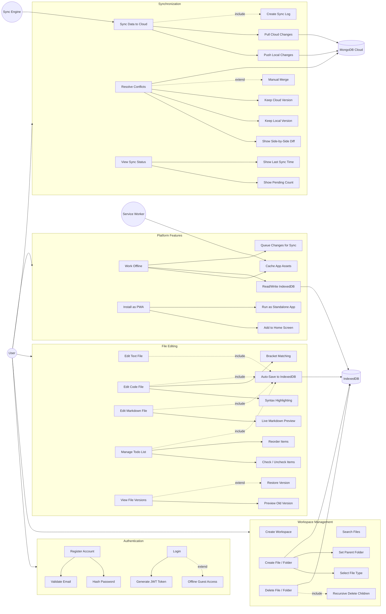

# Safar - Use Case Document

| **User** | A person who wants to write, code, or plan while traveling offline |
| **System** | SafarSetu Pro application (frontend + backend) |
| **IndexedDB** | Browser-based local database for offline storage |
| **MongoDB Cloud** | Remote cloud database for persistent storage & sync |
| **Service Worker** | Background process for caching and offline support |
| **Sync Engine** | Module that manages data synchronization between local and cloud |

## Use Case Diagram

