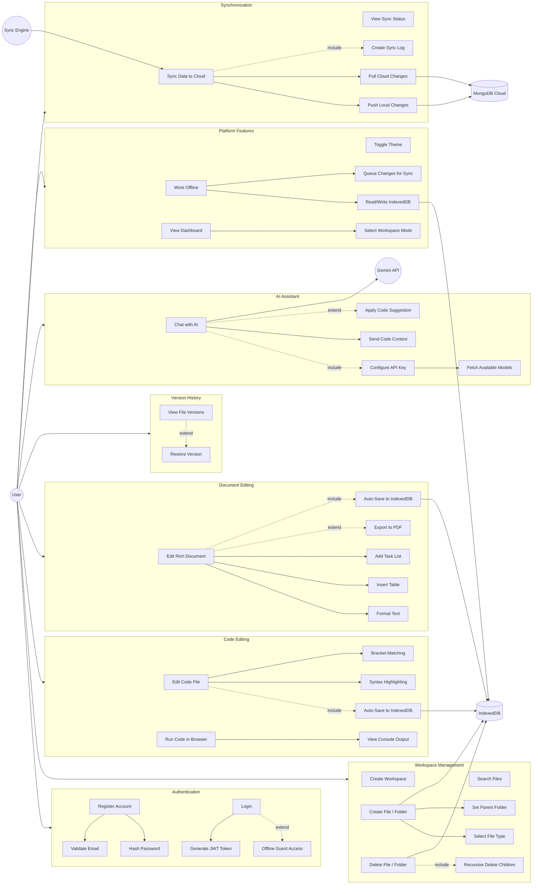

# Safar - Use Case Document

| **User** | A person who wants to write, code, or plan using Safar Studio |
| **System** | Safar application (frontend + backend) |
| **IndexedDB** | Browser-based local database for offline storage |
| **MongoDB Cloud** | Remote cloud database for persistent storage & sync |
| **Sync Engine** | Module that manages data synchronization between local and cloud |
| **Gemini API** | Google's AI model API for the built-in coding assistant |

## Use Case Diagram

